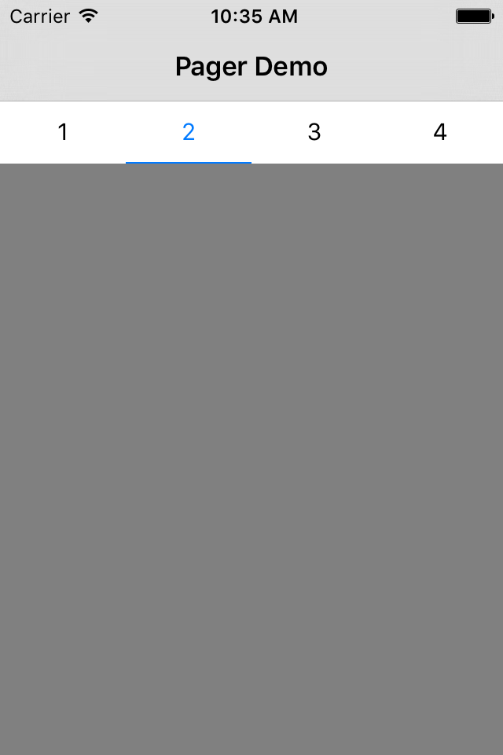

# JLPagerTabView

Inspired by https://github.com/ming1016/PagerTab.

## Usage

```objective-c
JLPagerTabViewController *pagerVC = [[JLPagerTabViewController alloc] initWithTabTitles:@[@"1", @"2", @"3", @"4"]];

UIViewController *vc1 = [[UIViewController alloc] init];
vc1.view.backgroundColor = [UIColor greenColor];
    
UIViewController *vc2 = [[UIViewController alloc] init];
vc2.view.backgroundColor = [UIColor grayColor];
    
UIViewController *vc3 = [[UIViewController alloc] init];
vc3.view.backgroundColor = [UIColor blueColor];
    
UIViewController *vc4 = [[UIViewController alloc] init];
vc4.view.backgroundColor = [UIColor yellowColor];
    
[pagerVC setViewControllers:@[vc1, vc2, vc3, vc4]];
[pagerVC setSelectedIndex:1];

```
## Screenshot

